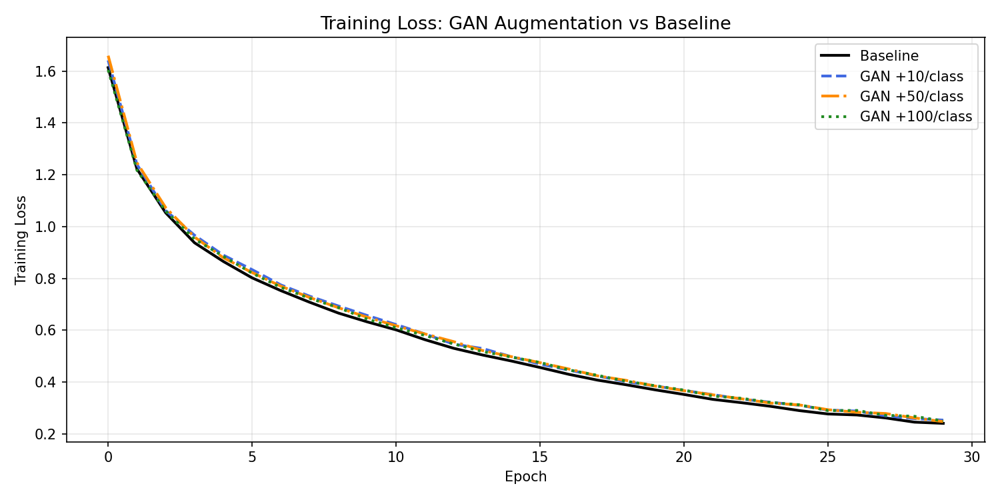
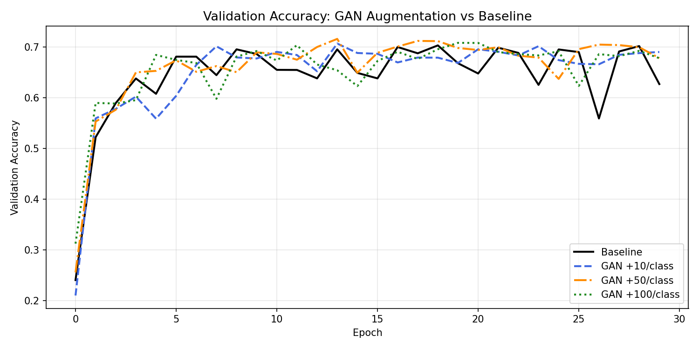
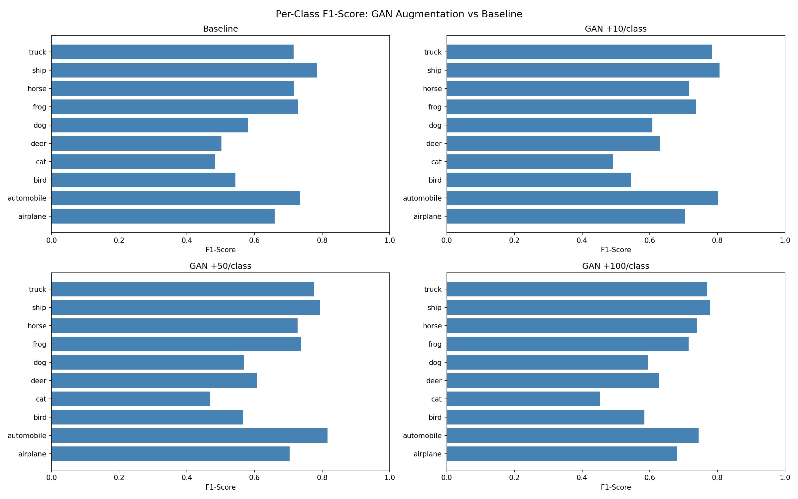
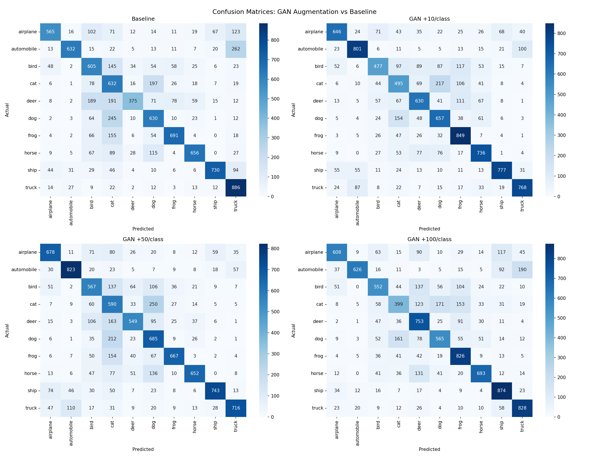

# Generative AI for Image Augmentation on CIFAR-10

> **Course:** Generative AI — Spring 2026 | **Instructor:** Dr. Muhammad Atif Tahir  
> **Team:** Abdullah Iqbal · Mahnoor · Hamza Zaman

---

## Overview

This project systematically investigates whether synthetic data generated by modern generative models can improve image classification accuracy on the CIFAR-10 benchmark. We train a CNN classifier as the evaluation backbone and augment its training set using three distinct generative paradigms — **Variational Autoencoders**, **Generative Adversarial Networks**, and (in progress) **Large Language Models** — measuring the effect of 10, 50, and 100 synthetic samples per class at each stage.

---

## Dataset

**CIFAR-10** — 60,000 colour images (32×32 px) across 10 mutually exclusive classes:

| Label | Class | Label | Class |
|-------|------------|-------|------------|
| 0 | Airplane | 5 | Dog |
| 1 | Automobile | 6 | Frog |
| 2 | Bird | 7 | Horse |
| 3 | Cat | 8 | Ship |
| 4 | Deer | 9 | Truck |

- Training split: 45,000 images (90 %) + 5,000 validation (10 %)  
- Test split: 10,000 images (held out throughout)

---

## Project Structure

```
Gen_AI_Project/
│
├── PartA/
│   ├── genai-project-partA.ipynb   # CNN baseline classifier
│   └── GenAI_Project_PartA_Report.pdf
│
├── PartB/
│   ├── genai-project-part-B.ipynb  # CVAE training + augmented CNN
│   └── GenAI_Project_PartB_Report.pdf
│
├── PartC/
│   ├── genai-project-part-C.ipynb  # CGAN training + augmented CNN
│   ├── GenAI_Project_PartC_Report.pdf
│   └── results/
│       ├── train_loss_comparison.png
│       ├── val_accuracy_comparison.png
│       ├── f1_per_class_comparison.png
│       └── confusion_matrices.png
│
└── README.md
```

---

## Part A — CNN Baseline

### Architecture

A deep convolutional network built following the book reference:

```
Input (32×32×3)
 → Conv2D(32) → BN → LeakyReLU
 → Conv2D(32, stride=2) → BN → LeakyReLU
 → Conv2D(64) → BN → LeakyReLU
 → Conv2D(64, stride=2) → BN → LeakyReLU
 → Conv2D(128) → BN → LeakyReLU → Flatten
 → Dense(128) → BN → LeakyReLU → Dropout
 → Dense(10, Softmax)
```

Trained with **Adam (lr=0.0005)**, categorical cross-entropy, **30 epochs**, batch size 128.

### Results

| Metric | Value |
|--------|-------|
| Test Loss | 1.3136 |
| **Test Accuracy** | **69.30 %** |

**Per-class F1 Scores:**

| Class | Precision | Recall | F1 |
|-----------|-----------|--------|----|
| Airplane | 0.72 | 0.72 | 0.72 |
| Automobile | 0.81 | 0.83 | 0.82 |
| Bird | 0.54 | 0.59 | 0.57 |
| Cat | 0.52 | 0.51 | 0.51 |
| Deer | 0.61 | 0.68 | 0.64 |
| Dog | 0.60 | 0.60 | 0.60 |
| Frog | 0.86 | 0.67 | 0.75 |
| Horse | 0.70 | 0.77 | 0.73 |
| Ship | 0.86 | 0.74 | 0.79 |
| Truck | 0.79 | 0.81 | 0.80 |

---

## Part B — Conditional VAE (CVAE) Augmentation

### Architecture

A **Conditional Variational Autoencoder** that conditions both the encoder and decoder on one-hot class labels, enabling targeted per-class image synthesis.

Key design choices:
- **Latent dimension:** 256
- **Reparameterisation trick** via a custom `Sampling` layer
- **KL Annealing** — KL weight linearly ramped from 0 → 1 over the first 20 warm-up epochs (out of 60 total), preventing posterior collapse
- Reconstruction loss: pixel-wise binary cross-entropy; KL divergence regularises the latent space

### Augmentation Experiments

The same CNN from Part A was retrained from scratch on:

| Configuration | Training Samples | Test Accuracy |
|---------------|-----------------|---------------|
| Baseline (no augmentation) | 45,000 | 67.98 % |
| + 10 synthetic / class | 45,100 | 67.28 % |
| + 50 synthetic / class | 45,500 | 68.20 % |
| + 100 synthetic / class | 46,000 | **68.79 %** |

### Discussion

CVAE-generated images showed marginal and inconsistent gains. The VAE objective trades reconstruction fidelity for a smooth, regularised latent space — this tends to produce blurry samples that lack the high-frequency texture detail CIFAR-10 images require. The classifier extracts little discriminative signal from such artefacts, and with only 10–100 additions against 45,000 real images the augmented fraction is too small to shift the decision boundary meaningfully.

---

## Part C — Conditional GAN (CGAN) Augmentation

### Architecture

A **Conditional GAN** where both the generator and discriminator receive a one-hot class label, forcing the adversarial game to be played class-conditionally.

**Generator:**
```
[Noise z ∈ R^100 ‖ One-hot label] → Dense(8×8×256) → BN → LeakyReLU
→ Reshape(8,8,256)
→ Conv2DTranspose(128, 4×4, stride=2) → BN → LeakyReLU   # 16×16
→ Conv2DTranspose(64,  4×4, stride=2) → BN → LeakyReLU   # 32×32
→ Conv2D(3, tanh)                                         # 32×32×3
```

**Discriminator:**
```
[Image ‖ Label-broadcast-to-image] → Conv2D blocks (mirrors CNN encoder)
→ Dense(1, Sigmoid)
```

Trained with **Adam (lr=0.0002, β₁=0.5)** and **Binary Cross-Entropy** adversarial loss for 100 epochs.

### Augmentation Experiments

| Configuration | Training Samples | Test Accuracy |
|---------------|-----------------|---------------|
| Baseline (no augmentation) | 45,000 | 64.02 % |
| + 10 GAN samples / class | 45,100 | **68.36 %** |
| + 50 GAN samples / class | 45,500 | 66.70 % |
| + 100 GAN samples / class | 46,000 | 67.24 % |

### Result Plots

| | |
|---|---|
|  |  |
|  |  |

### Discussion

The +10 configuration yielded the largest single jump (+4.34 pp over baseline), suggesting that even a small number of well-distributed GAN samples can correct class imbalance artifacts introduced by training variance. However, scaling to 50 or 100 samples per class did not maintain the gain — likely because GAN outputs at this scale still exhibit mode collapse on visually complex classes (cat, bird), and flooding the dataset with imperfect fakes introduces label noise that partially cancels the benefit. The adversarial training dynamics are also sensitive to hyperparameters; a more extensive search could yield more consistent improvements.

---

## Part D — LLM-Based Data Generation *(in progress)*

Planned: leverage a multimodal LLM to generate or caption-then-diffuse synthetic CIFAR-10 images, then repeat the augmentation study at 10 / 50 / 100 samples per class.

---

## Cumulative Accuracy Summary

| Method | Baseline | +10 / class | +50 / class | +100 / class |
|--------|----------|-------------|-------------|--------------|
| No augmentation (Part A) | **69.30 %** | — | — | — |
| CVAE (Part B) | 67.98 % | 67.28 % | 68.20 % | 68.79 % |
| CGAN (Part C) | 64.02 % | **68.36 %** | 66.70 % | 67.24 % |

---

## Setup & Reproduction

### Requirements

```bash
pip install tensorflow numpy matplotlib seaborn scikit-learn
```

All experiments were run on **Kaggle GPU** (Tesla T4 / P100). Expected runtimes:

| Part | Approximate Runtime |
|------|-------------------|
| Part A (CNN, 30 epochs) | ~3 min |
| Part B (CVAE, 60 epochs + 4× CNN) | ~40 min |
| Part C (CGAN, 100 epochs + 4× CNN) | ~35 min |

### Execution Order

```
PartA/genai-project-partA.ipynb     # train & evaluate CNN baseline
PartB/genai-project-part-B.ipynb    # train CVAE → generate → retrain CNN
PartC/genai-project-part-C.ipynb    # train CGAN → generate → retrain CNN
```

Each notebook is self-contained and downloads CIFAR-10 automatically via `tensorflow.keras.datasets`.

---

## Key Takeaways

1. **GANs generate sharper images than VAEs** for CIFAR-10, translating to a more noticeable (if unstable) classification boost.
2. **Small augmentation doses work best** — at 10 samples/class the signal-to-noise ratio of synthetic data is still favourable; larger doses introduce noise faster than they add signal given the current generator quality.
3. **Generative model quality is the bottleneck**, not the downstream classifier. Better training stability (spectral normalisation, progressive growing) or higher-capacity generators would likely shift the results.
4. A vanilla CNN at 30 epochs still reaches **~69 % on CIFAR-10** — a solid baseline that is hard to beat cheaply with synthetic data alone.

---

## Team Contributions

| Member | Contributions |
|--------|--------------|
| **Abdullah Iqbal** | CGAN design & training (Part C), CNN evaluation pipeline, result visualisations, repository management |
| **Mahnoor** | CVAE architecture, KL annealing strategy, Part B analysis & report |
| **Hamza Zaman** | CNN baseline (Part A), data preprocessing, per-class metric analysis, combined report |

---

## References

- Krizhevsky, A. (2009). *Learning Multiple Layers of Features from Tiny Images.* — CIFAR-10 dataset.
- Kingma, D. P., & Welling, M. (2013). *Auto-Encoding Variational Bayes.* arXiv:1312.6114
- Goodfellow, I. et al. (2014). *Generative Adversarial Nets.* NeurIPS.
- Mirza, M., & Osindero, S. (2014). *Conditional Generative Adversarial Nets.* arXiv:1411.1784
- Chollet, F. (2021). *Deep Learning with Python, 2nd Edition.* Manning Publications.
